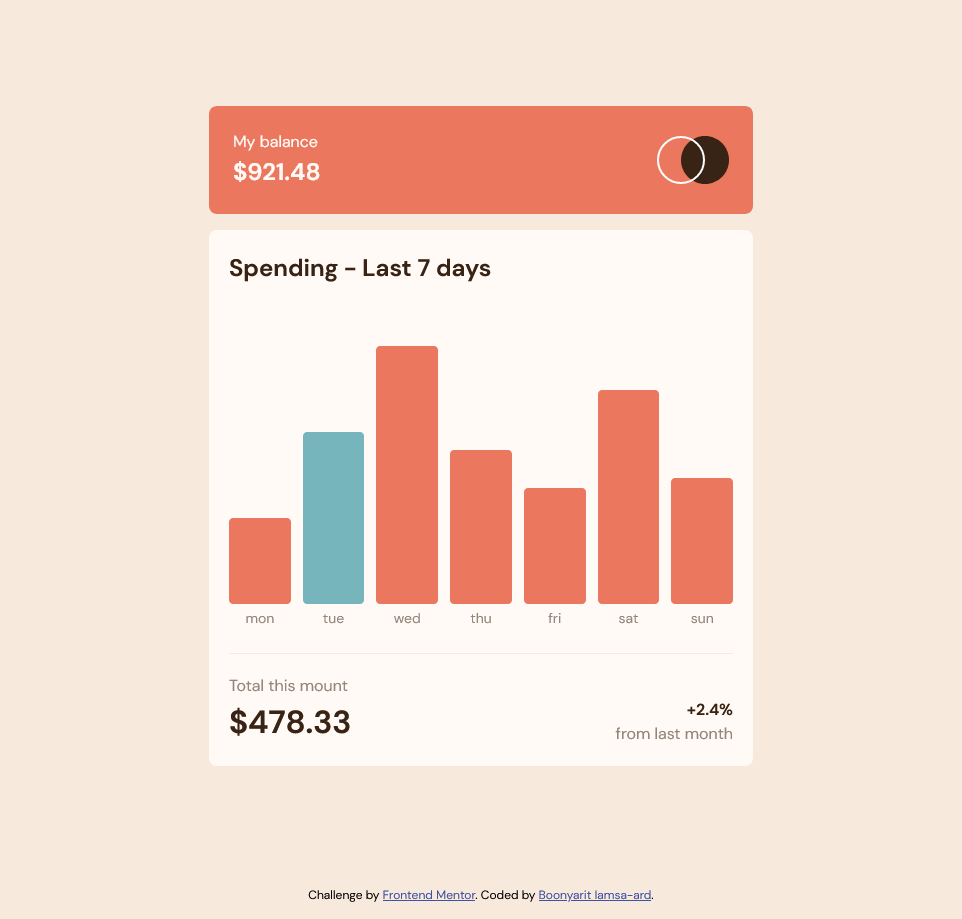

# Frontend Mentor - Expenses chart component solution

This is a solution to the [Expenses chart component challenge on Frontend Mentor](https://www.frontendmentor.io/challenges/expenses-chart-component-e7yJBUdjwt). Frontend Mentor challenges help you improve your coding skills by building real projects.

## Table of contents

- [Overview](#overview)
  - [The challenge](#the-challenge)
  - [Screenshot](#screenshot)
  - [Links](#links)
- [My process](#my-process)
  - [Built with](#built-with)
  - [What I learned](#what-i-learned)
  - [Continued development](#continued-development)
  - [Useful resources](#useful-resources)
- [Author](#author)

## Overview

### The challenge

Users should be able to:

- View the bar chart and hover over the individual bars to see the correct amounts for each day
- See the current day’s bar highlighted in a different color than the other bars
- View the optimal layout for the content depending on their device’s screen size
- See hover states for all interactive elements on the page
- **Bonus**: Use the JSON data file provided to dynamically size the bars on the chart

### Screenshot



### Links

- Solution URL: [GitHub](https://github.com/boonyarit-iamsaard/fm-expenses-card-component)
- Live Site URL: [Live Preview](https://boonyarit-iamsaard.github.io/fm-expenses-card-component/)

## My process

### Built with

- Semantic HTML5 markup
- CSS custom properties
- CSS Flexbox
- CSS Grid
- Mobile-first workflow
- Vanilla JavaScript

### What I learned

Fetching local JSON file using Fetch API with async/await, and try/catch instead of `fetch().then().catch()`.

See the code snippet below:

```js
const fetchData = async () => {
  const url = 'path to your JSON file';

  try {
    const response = await fetch(url);
    return await response.json(); // this will return Promise object not the data
  } catch (error) {
    throw new Error(error.message); // or your custom error message
  }
};

const manipulateData = async () => {
  try {
    const data = await fetchData();

    // manipulate the data here
    console.log(data);
  } catch (error) {
    // handling the error here e.g. show the erroe message on the screen
    console.log(error);
  }
};
```

### Continued development

- [ ] Implement chart column growing animation.

### Useful resources

-

## Author

- Website - [GitHub](https://github.com/boonyarit-iamsaard)
- Frontend Mentor - [@boonyarit-iamsaard](https://www.frontendmentor.io/profile/boonyarit-iamsaard)
